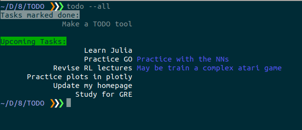

### TODO tool
Simple command line tool to store TODO tasks.

Use and examples:
* `todo --add "Learn Julia"` : Add the task
* `todo --add "Practice GO" --detail "Practice with the NNs"` : Add the task along with some details
* `todo --add "Make a TODO tool"`
* `todo --done "Make a TODO tool"` : Mark the task done
* `todo --remove "Learn Julia"`: Remove the task
* `todo --all` : Print all tasks, including those marked `done`
* `todo --upcoming` : Print only yet-to-do tasks

Screenshot:

    

